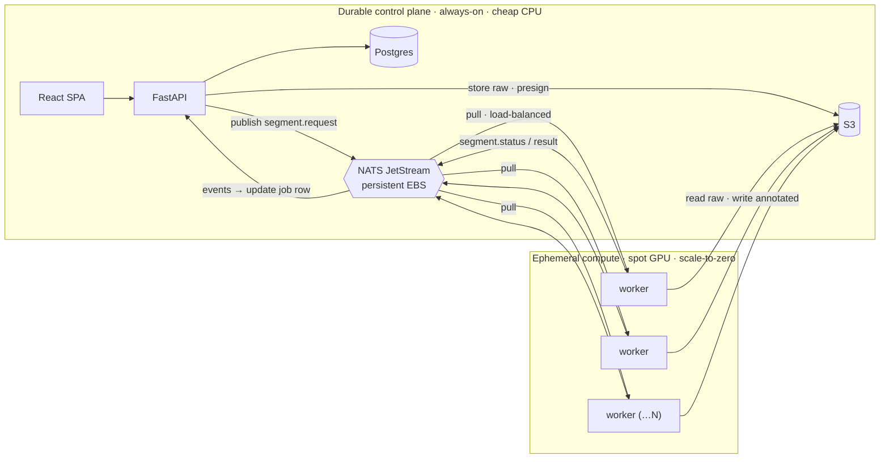

# Scaling to a GPU worker pool

The demo runs one of everything on a single host. The natural next step — and a
much better cost profile — is to split the system into a **durable control
plane** (cheap, always-on CPU services) and an **ephemeral compute plane** (spot
GPU workers that scale to zero). The GPU is billed only while images are actually
being segmented; the queue absorbs bursts.

The good news: the architecture already supports this. The decoupling from M2
wasn't just tidiness — it's exactly what makes a worker pool work.

## Topology

(The README's architecture diagram still describes the **default single-worker**
deployment, which is unchanged. This is the scaled-out variant.)

## Why the design already fits

- **The worker only talks to NATS + object storage — never Postgres.** A worker
  node needs nothing but `NATS_URL`, S3 credentials, and `HF_TOKEN`. It's
  stateless and disposable.
- **At-least-once + idempotent processing.** Each request is delivered to one
  worker; if that worker dies mid-job (e.g. a spot reclaim), the unacked message
  is **redelivered to another worker**, and the worker's `head_object` check
  skips re-doing finished work. Spot interruption handling is essentially free.
- **One stateful thing per node — the model** — and it loads from the cached
  checkpoint, so a fresh worker is warm in seconds.

## The one change that was needed

A JetStream **push** consumer can only be bound by one subscriber. The worker now
uses a shared **pull** consumer (`seg-workers`): any number of worker processes
bind the same durable and JetStream load-balances `segment.request` across them.
See `worker/worker.py::consume`. Verified (no GPU) by `tests/test_fanout.py`,
which runs a real NATS JetStream and several workers and asserts each request is
processed exactly once and spread across the pool.

## Running the pool

Each spot GPU node boots from a **golden AMI** (driver + NVIDIA toolkit + Docker
+ the built worker image + the cached checkpoint — see
[`test-on-aws.md`](./test-on-aws.md)) and starts the worker container with:

- `NATS_URL` → the durable broker (private IP)
- `S3_ENDPOINT` **unset** → real AWS S3 (the env swap already exists)
- `AWS_*` creds (or an instance role) and `HF_TOKEN`

Inject these at launch (user-data / SSM Parameter Store) — don't bake secrets
into the AMI.

- **Durable broker.** Run NATS with JetStream **file storage on a persistent EBS
  volume** so queued requests survive a broker restart and survive the pool
  being scaled to zero.
- **Scale signal = queue depth.** JetStream exposes the consumer's `num_pending`;
  add spot nodes when the backlog grows, terminate when idle. Manual script →
  Auto Scaling Group on a custom CloudWatch metric → KEDA if you go Kubernetes.
- **Cold start.** A new worker still loads the model into VRAM (~10–30 s) even
  with the checkpoint cached. Scale-to-zero is fine for throughput; keep one warm
  worker if first-job latency matters.
- **Secure NATS** once it's network-exposed beyond one host: TLS + credentials,
  on a private subnet.

## Not built here (sensible follow-ups)

- An actual autoscaler (this repo just makes the workers poolable).
- A dedicated request stream with **`WorkQueue` retention** (tidier than sharing
  the `SEGMENT` stream) and a **dead-letter** path for messages that exceed a
  redelivery limit.
- **NATS clustering** + managed Postgres for control-plane HA (the demo's single
  instances are fine for a demo, not for production resilience).
